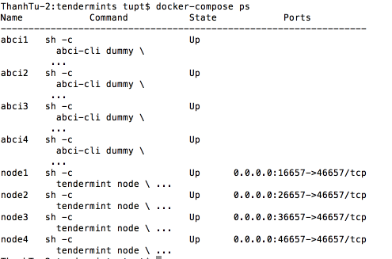
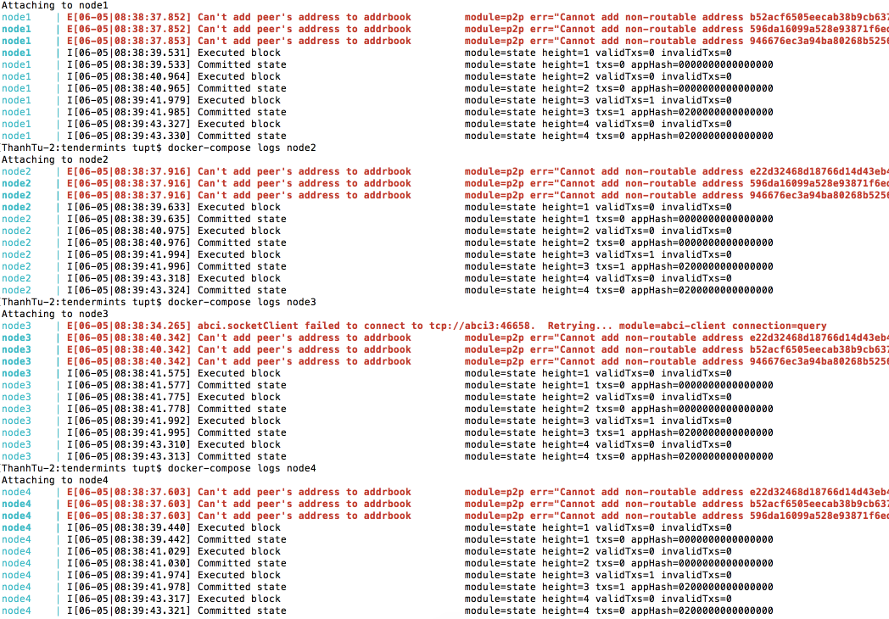

# Tendermint

## Initialization

Running:

```
# if this is the second time
yarn reset
# then start the network
yarn start
# show list
docker-compose ps
```



Check the status with:

```
curl -s localhost:46657/status
```

### Sending Transactions

With the dummy app running, we can send transactions:

```
curl -s 'localhost:46657/broadcast_tx_commit?tx="abcd"'
```

and check that it worked with:

```
curl -s 'localhost:46657/abci_query?data="abcd"'
```

We can send transactions with a key and value too:

```
curl -s 'localhost:46657/broadcast_tx_commit?tx="name=satoshi"'
```

and query the key:

```
curl -s 'localhost:46657/abci_query?data="name"'
# query the key at other node
curl -s 'localhost:36657/abci_query?data="name"'
```

where the value is returned in hex.

Note that using p2p.persistent_peers, each node will try to dial peers until they are online. So at the beginning you may be warned that the seed nodes are offline.


## Cluster of Nodes

First create four Ubuntu cloud machines. The following was tested on Digital Ocean Ubuntu 16.04 x64 (3GB/1CPU, 20GB SSD). We'll refer to their respective IP addresses below as IP1, IP2, IP3, IP4.

Then, `ssh` into each machine, and execute [this script](https://git.io/vh40C):

```
curl -L https://git.io/vh40C | bash
source ~/.profile
```

This will install `go` and other dependencies, get the Tendermint source code, then compile the `tendermint` binary.

Next, `cd` into `docs/examples`. Each command below should be run from each node, in sequence:

```
abci-cli dummy --addr="tcp://IP1:46658"
abci-cli dummy --addr="tcp://IP2:46658"
abci-cli dummy --addr="tcp://IP3:46658"
abci-cli dummy --addr="tcp://IP4:46658"

tendermint node --home ./node1 --proxy_app=tcp://IP1:46658 --p2p.seeds IP2:46656,IP3:46656,IP4:46656 --consensus.create_empty_blocks=false

tendermint node --home ./node2 --proxy_app=tcp://IP2:46658 --p2p.seeds IP1:46656,IP3:46656,IP4:46656 --consensus.create_empty_blocks=false

tendermint node --home ./node3 --proxy_app=tcp://IP3:46658 --p2p.seeds IP1:46656,IP2:46656,IP4:46656 --consensus.create_empty_blocks=false

tendermint node --home ./node4 --proxy_app=tcp://IP4:46658 --p2p.seeds IP1:46656,IP2:46656,IP3:46656 --consensus.create_empty_blocks=false
```

Note that after the third node is started, blocks will start to stream in because >2/3 of validators (defined in the `genesis.json`) have come online. Seeds can also be specified in the `config.toml`. See [this PR](https://github.com/tendermint/tendermint/pull/792) for more information about configuration options.

Transactions can then be sent as covered in the single, local node example above.
